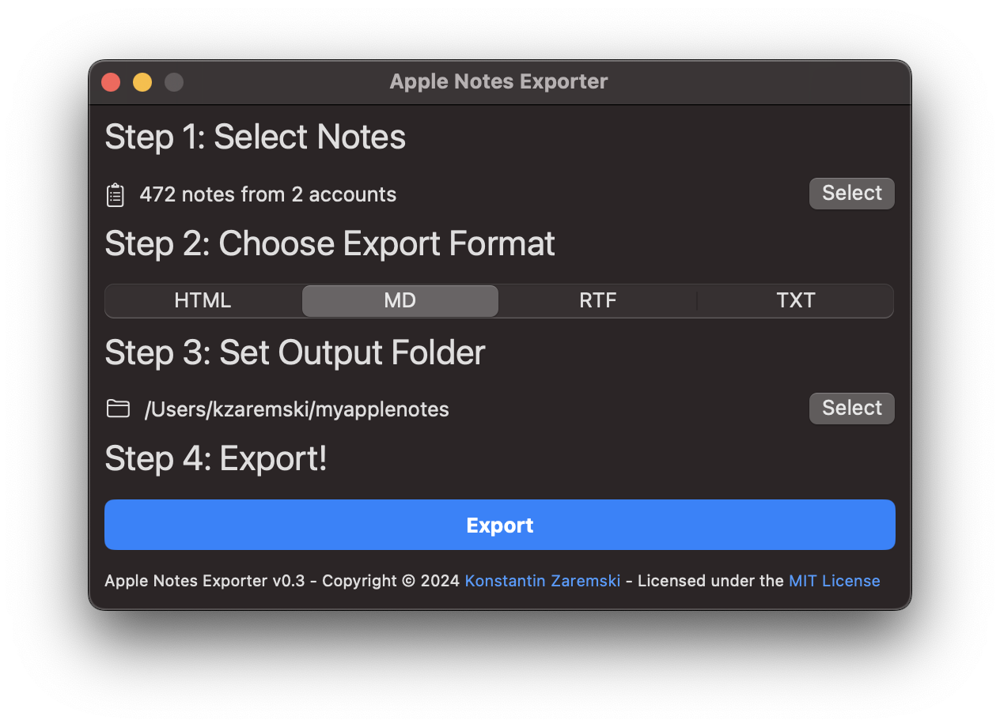
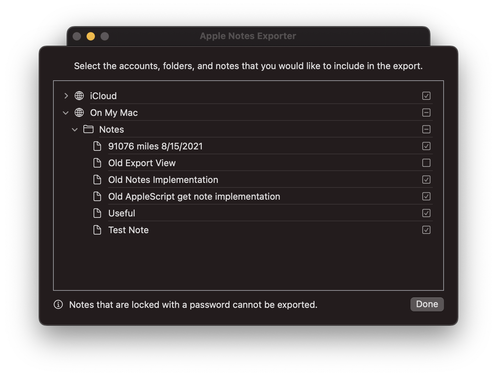
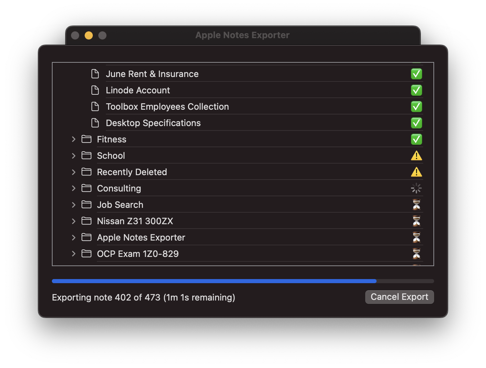

# apple-notes-exporter
MacOS app written in Swift that bulk exports Apple Notes (including iCloud Notes) to a multitude of formats preserving note folder structure.



## Purpose & Rationale

Many choose to do all of their note taking and planning through Apple Notes because of the simplicity and convenience that it offers.

## Export Formats
* HTML
    * Native format returned by the Apple Notes API.
    * HTML format can be used to publish to the web or store locally.
    * Images are included inline using the HTML base64 embed syntax.
    * Portable between browsers and formats well when printed.
* TEX
    * LaTeX format.
    * Can be compiled using the LaTeX typesetting software.
        * Notes can be compiled individually or many can be included within a single document.
* MD
    * Markdown format.
    * Useful if moving to other Markdown-based note taking apps.
    * Images are included inline using the HTML base64 embed syntax.
* RTF
    * Rich text format.
    * Can be opened with WordPad on Windows or TextEdit on MacOS.
    * Preserves formatting however there are no inline attachments or images.
* TXT
    * Plain text format.
    * No images or formatting.

Attachments are always saved in a folder corresponding to the name/title of the note that they are associated with.

#### What about PDF?
Apple's APIs for programmatically generating PDFs within Swift on MacOS are difficult to work with and poorly documented.

All research in this domain has lead me to a variety of answers and solutions but there has never been the perfect solution that solves all of my problems.
For instance, some people say to use the CoreText features, but there is no straightforward way to include images.
Other solutions say to render the HTML to a WebKit object and then to create a print operation and "print" to a PDF, but this does not work well with concurrent threads as it wants to run on the UI thread.
I also tried my own solution: embed a binary for WKHTMLtoPDF in the app, but Apple's code signing requirements for MacOS apps and all included binaries proved to make this difficult.

There is a pre-release available in the resources page that has my best implementation of the PDF export functionality. It produced PDFs that are not sized correctly, with text clipping off of the edges of the page.

I was not going to let PDF be the functionality that made me lose my resolve to finish at least a first version of this project. (meaning: I have given up, for now)

-----
***If you are a Swift developer that knows how to implement this and wants to help, I greatly welcome your contributions. Please open a pull request.***

## Compatibility & System Requirements
* MacOS Big Sur 11.0 or higher
    * Some of the features that I am using are not available in earlier MacOS versions.
    * I was able to backport from Ventura back to Big Sur, but any further would have required rewrites of the UI because of the changes made to the MacOS UI at that time.
* Intel or Apple Silicon Mac
* 8GB RAM recommended
    * As the app moves through each note and exports them, it retains their content in memory after the export is completed.
    * For every 500 notes the app will use approximately 1GB of RAM
    * RAM usage will be optimized in the future.
* Disk Space
    * 3MB to accommodate the app itself
    * Additional space for your exported notes and their attachments

## Additional Screenshots
Account, folder, and note selection view.

Export progress view indicating total progress and error details on a note-by-note basis.


## Installation
#### The app is not officially notarized by Apple since I am not able to pay for a developer account annually at this time, thus you may encounter some difficulties when trying to run the app for the first time.

-----

Make sure that you have "App Store and Identified Developers" set as your app install sources in the "Privacy & Security" section of System Settings in MacOS.

When opening the app as downloaded from the releases page you may be met with a message:

```
"Apple Notes Exporter" can't be opened because Apple cannot check it for malicious software.
This software needs to be updated.
Contact the developer for more information.
``````

Go to the "Privacy & Security" pane of System Settings and click "Open Anyway" under the "Security" section towards the bottom of the pane. See Apple's article https://support.apple.com/en-us/HT202491 if you need more help or a better explanation on how to make an exception for the app to run.

---

#### Tip For Faster Exporting
While exporting, keep the Apple Notes app as the main app in the foreground. The Apple Events work faster when they are being sent to an application that is focused by the user and has a higher priority.

## License
```
MIT License

Copyright (c) 2024 Konstantin Zaremski

Permission is hereby granted, free of charge, to any person obtaining a copy
of this software and associated documentation files (the "Software"), to deal
in the Software without restriction, including without limitation the rights
to use, copy, modify, merge, publish, distribute, sublicense, and/or sell
copies of the Software, and to permit persons to whom the Software is
furnished to do so, subject to the following conditions:

The above copyright notice and this permission notice shall be included in all
copies or substantial portions of the Software.

THE SOFTWARE IS PROVIDED "AS IS", WITHOUT WARRANTY OF ANY KIND, EXPRESS OR
IMPLIED, INCLUDING BUT NOT LIMITED TO THE WARRANTIES OF MERCHANTABILITY,
FITNESS FOR A PARTICULAR PURPOSE AND NONINFRINGEMENT. IN NO EVENT SHALL THE
AUTHORS OR COPYRIGHT HOLDERS BE LIABLE FOR ANY CLAIM, DAMAGES OR OTHER
LIABILITY, WHETHER IN AN ACTION OF CONTRACT, TORT OR OTHERWISE, ARISING FROM,
OUT OF OR IN CONNECTION WITH THE SOFTWARE OR THE USE OR OTHER DEALINGS IN THE
SOFTWARE.
```
