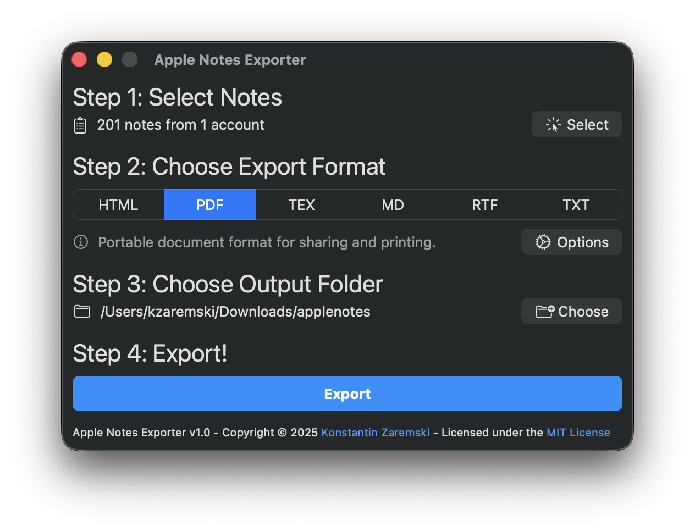
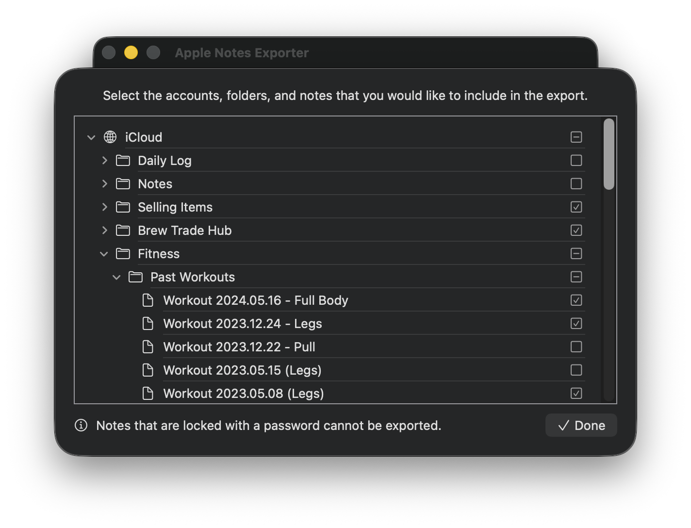
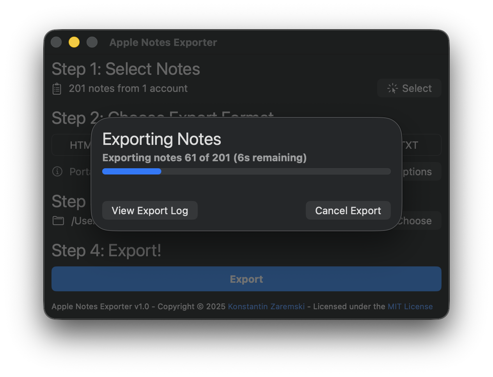
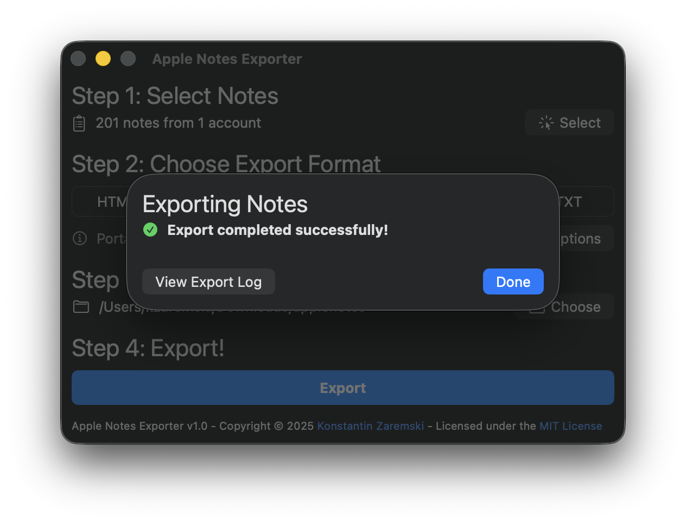
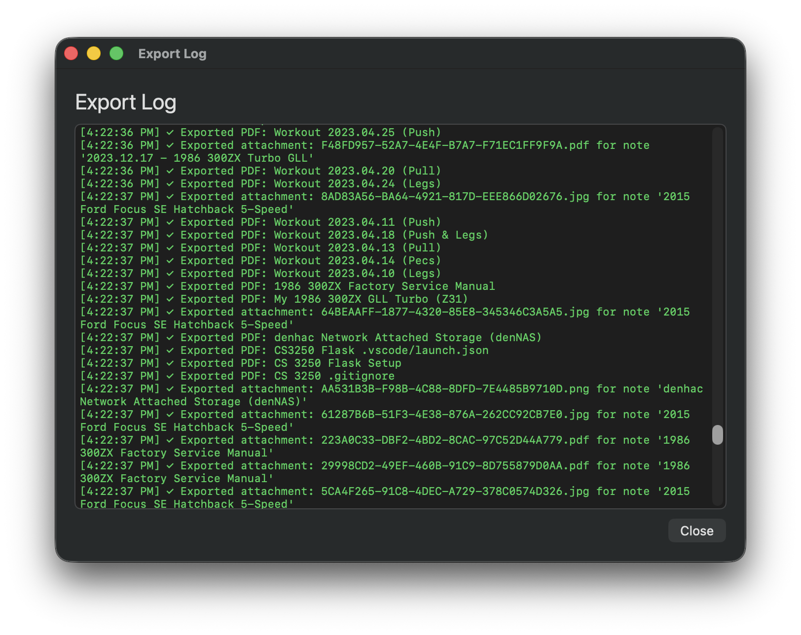
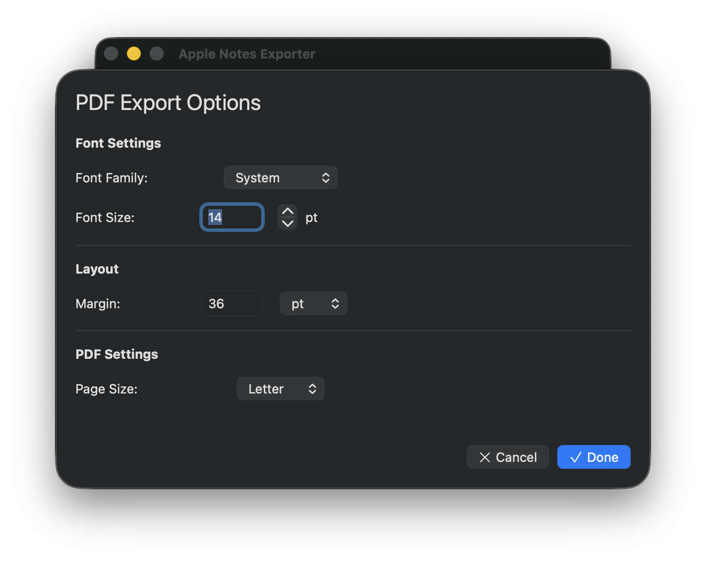
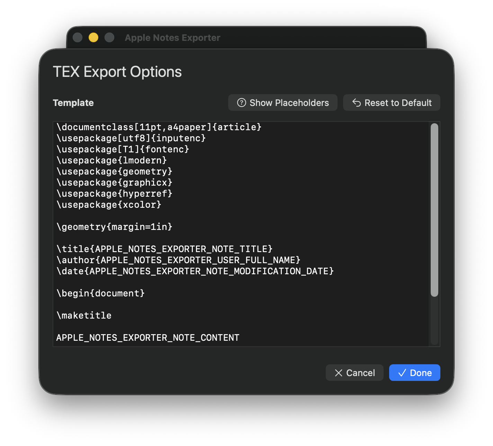

# apple-notes-exporter
MacOS app written in Swift that bulk exports Apple Notes (including iCloud Notes) to a multitude of formats preserving note folder structure.



## Purpose & Rationale

Many choose to do all of their note taking and planning through Apple Notes because of the simplicity and convenience that it offers. Unfortunately, there is no good workflow or mechanism built into Apple Notes that allows you to export all your notes or a group of your notes at once.  This app provides a fast, efficient way to export your entire notes library while maintaining the folder hierarchy and preserving formatting.

## Export Formats
* **HTML**
    * Native format returned by the Apple Notes database.
    * HTML format can be used to publish to the web or store locally.
    * Images are included inline using the HTML base64 embed syntax.
    * Portable between browsers and formats well when printed.
    * **Configurable:** Font family, font size, and margins
* **PDF**
    * Portable document format generated from HTML.
    * Preserves all formatting and images.
    * Perfect for sharing and archiving.
    * **Configurable:** Font family, font size, margins, and page size (Letter, A4, A5, Legal, Tabloid)
* **TEX**
    * LaTeX format for typesetting.
    * Can be compiled using the LaTeX typesetting software.
    * Notes can be compiled individually or many can be included within a single document.
    * **Configurable:** Custom template with placeholders for title, dates, author, and content
* **MD**
    * Markdown format.
    * Useful if moving to other Markdown-based note taking apps like Obsidian.
    * Images are included inline using the HTML base64 embed syntax.
* **RTF**
    * Rich text format.
    * Can be opened with WordPad on Windows or TextEdit on MacOS.
    * Preserves formatting however there are no inline attachments or images.
    * **Configurable:** Font family and font size
* **TXT**
    * Plain text format.
    * No images or formatting.

Attachments are always saved in a folder corresponding to the name/title of the note that they are associated with.

## Compatibility & System Requirements
* MacOS Big Sur 11.0 or higher
    * Some of the features that I am using are not available in earlier MacOS versions.
    * I was able to backport from Ventura back to Big Sur, but any further would have required rewrites of the UI because of the changes made to the MacOS UI at that time.
* Intel or Apple Silicon Mac
* 4GB RAM minimum
    * Optimized database-driven approach uses approximately 200MB of RAM regardless of Notes library size
    * Concurrent export processing for maximum performance
* Disk Space
    * 20MB to accommodate the app itself
    * Additional space for your exported notes and their attachments

## Limitations
As of version 1.0, Apple Notes Exporter no longer supports exporting from accounts other than iCloud accounts and the On My Mac account. This includes notes stored in Gmail, Yahoo, Outlook, and other email-based accounts.

### Workaround for Email Account Notes
If you have notes in Gmail, Yahoo, Outlook, or other email accounts that you want to export:

1. Open the Apple Notes app
2. Select the notes you want to export from your email account
3. Drag and drop them into a folder under "On My Mac" or one of your iCloud accounts
4. Once moved, these notes will be accessible to Apple Notes Exporter and can be included in your export

This limitation is due to the database-driven approach used in version 1.0, which queries the local Notes database directly. Email-based note accounts store their data differently and are not included in the same database structure that iCloud and On My Mac accounts use.

## Additional Screenshots

**Note Selection**


**Export Progress**


**Export Complete**


**Detailed Export Log**


**PDF Export Options**


**LaTeX Template Editor**


## Installation
The latest download is available from the Github "Releases" tab.

Make sure that you have "App Store and Identified Developers" set as your app install sources in the "Privacy & Security" section of System Settings in MacOS.

**As of Version 0.4 Build 5, we are distributing a notarized executable.** *For older versions, go to the "Privacy & Security" pane of System Settings and click "Open Anyway" under the "Security" section towards the bottom of the pane. See Apple's article https://support.apple.com/en-us/HT202491 if you need more help or a better explanation on how to make an exception for the app to run.*

## Acknowledgements

This project benefited from the groundwork and research done by [threeplanetssoftware](https://github.com/threeplanetssoftware) on Apple Notes protobuf formats and database parsing in their [apple_cloud_notes_parser](https://github.com/threeplanetssoftware/apple_cloud_notes_parser) project. Their work was instrumental in understanding the Apple Notes database structure, enabling the transition from AppleScript-based export to the more efficient database-driven approach used in version 1.0.

## License
```
MIT License

Copyright (c) 2026 Konstantin Zaremski

Permission is hereby granted, free of charge, to any person obtaining a copy
of this software and associated documentation files (the "Software"), to deal
in the Software without restriction, including without limitation the rights
to use, copy, modify, merge, publish, distribute, sublicense, and/or sell
copies of the Software, and to permit persons to whom the Software is
furnished to do so, subject to the following conditions:

The above copyright notice and this permission notice shall be included in all
copies or substantial portions of the Software.

THE SOFTWARE IS PROVIDED "AS IS", WITHOUT WARRANTY OF ANY KIND, EXPRESS OR
IMPLIED, INCLUDING BUT NOT LIMITED TO THE WARRANTIES OF MERCHANTABILITY,
FITNESS FOR A PARTICULAR PURPOSE AND NONINFRINGEMENT. IN NO EVENT SHALL THE
AUTHORS OR COPYRIGHT HOLDERS BE LIABLE FOR ANY CLAIM, DAMAGES OR OTHER
LIABILITY, WHETHER IN AN ACTION OF CONTRACT, TORT OR OTHERWISE, ARISING FROM,
OUT OF OR IN CONNECTION WITH THE SOFTWARE OR THE USE OR OTHER DEALINGS IN THE
SOFTWARE.
```

## Star History

[](https://www.star-history.com/#kzaremski/apple-notes-exporter&type=date&legend=top-left)
