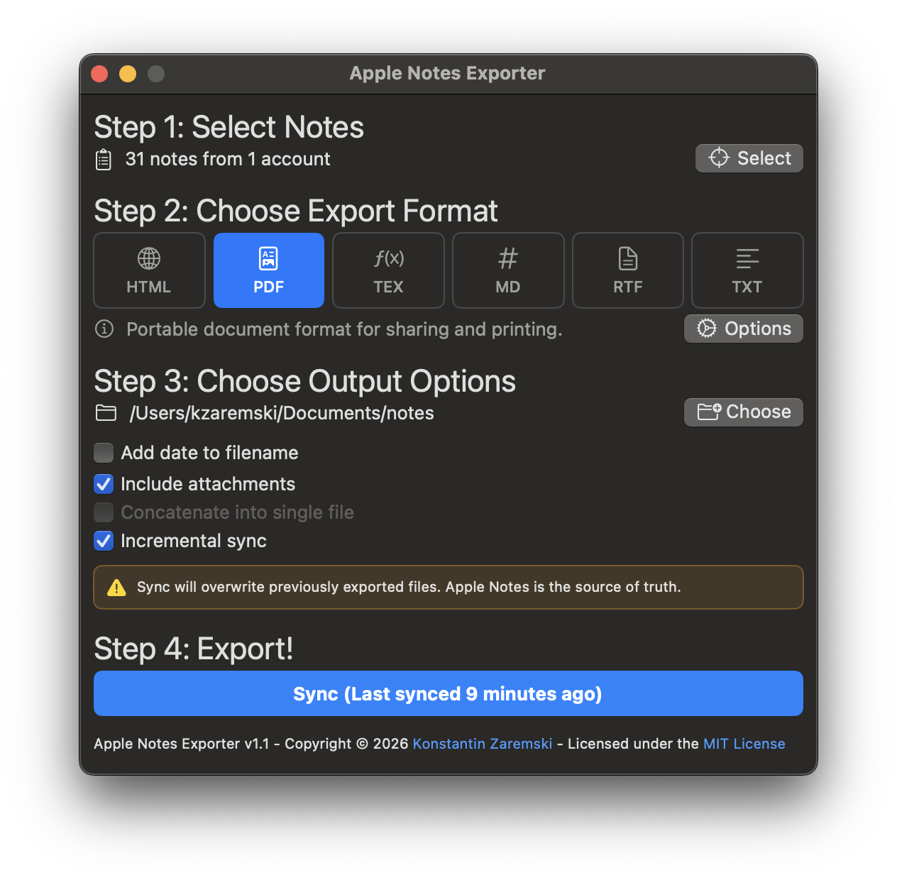
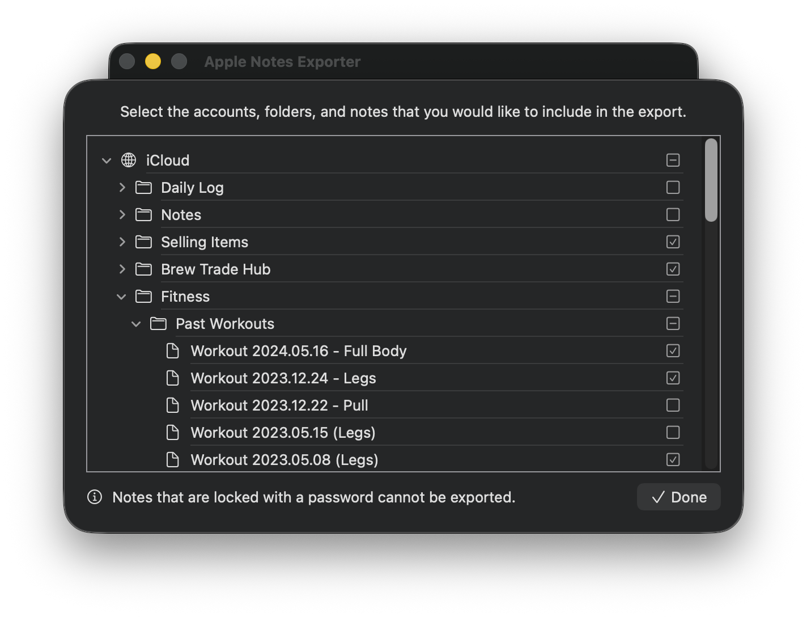
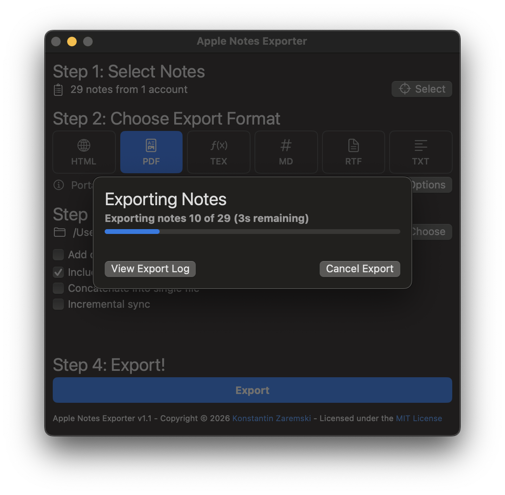
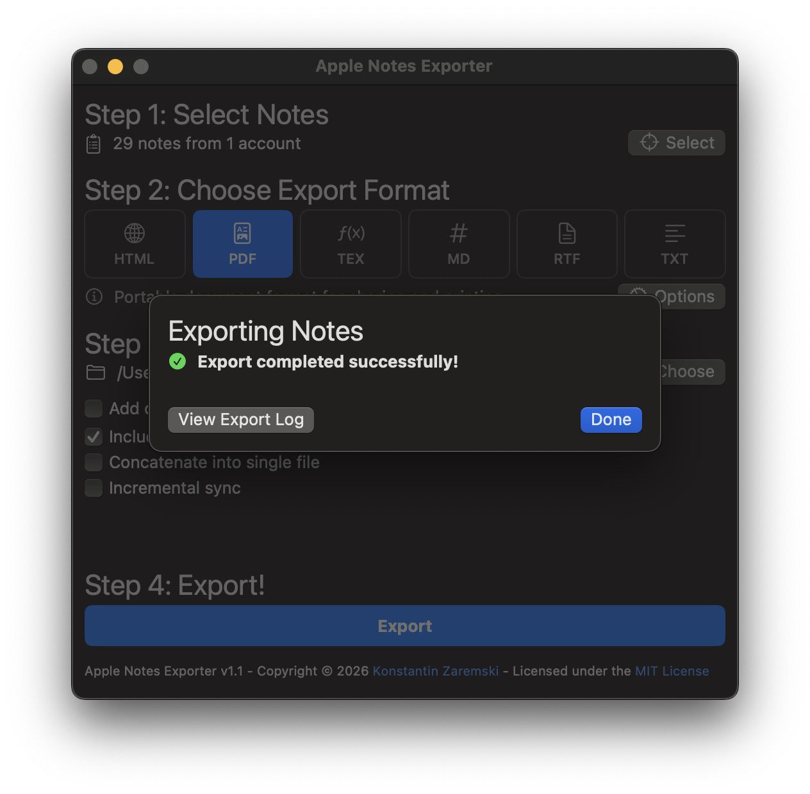
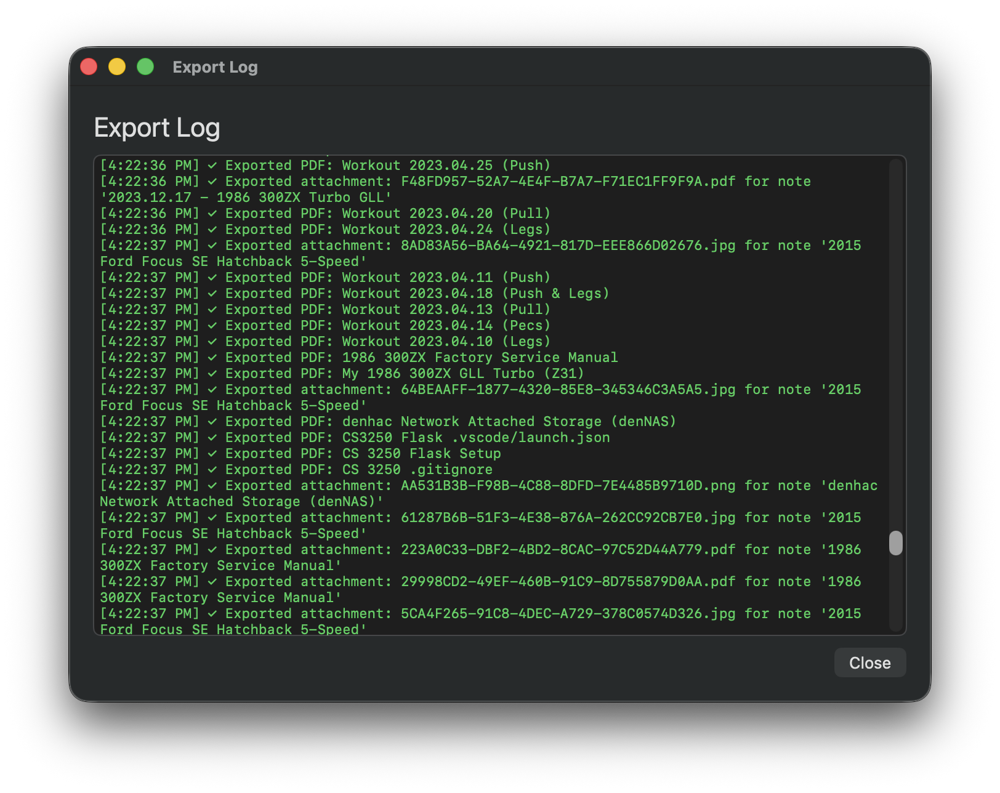
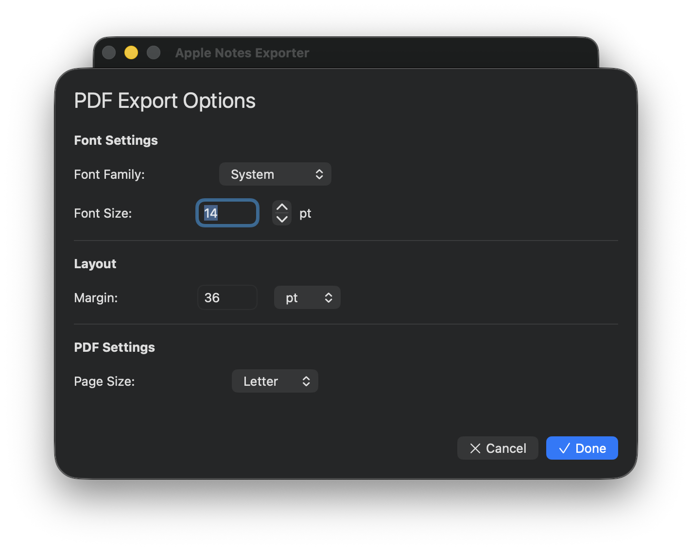
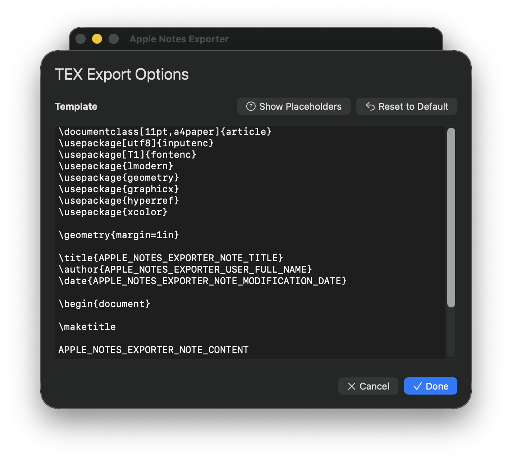

# Apple Notes Exporter (apple-notes-exporter)

[](https://www.gnu.org/licenses/gpl-3.0)
[](https://www.apple.com/macos/)
[](https://github.com/kzaremski/apple-notes-exporter/releases/latest)
[](https://github.com/kzaremski/apple-notes-exporter/releases)
[](https://github.com/kzaremski/apple-notes-exporter/stargazers)
[](https://github.com/kzaremski/apple-notes-exporter/issues)
[](https://github.com/kzaremski/apple-notes-exporter/commits/main)
[](https://swift.org/)

MacOS app written in Swift that bulk exports Apple Notes (including iCloud Notes) to a multitude of formats preserving note folder structure.

Built by [Konstantin Zaremski](https://konstantin.zarem.ski)



## Purpose & Rationale

Many choose to do all of their note taking and planning through Apple Notes because of the simplicity and convenience that it offers. Unfortunately, there is no good workflow or mechanism built into Apple Notes that allows you to export all your notes or a group of your notes at once.  This app provides a fast, efficient way to export your entire notes library while maintaining the folder hierarchy and preserving formatting.

## What's New in v2.0

* **Command-line interface** (`notes-export`) with subcommands for listing accounts, folders, and notes, plus full export support. JSON output for scripting.
* **Model Context Protocol server** (`notes-export-mcp`) exposes the exporter as MCP tools for AI assistants like Claude Desktop.
* **Apple Shortcuts support** via App Intents: Export Notes, List Accounts, and List Folders actions.
* **12 new export formats** in addition to the original 6 (18 total).
* **New app icon** designed by [Sascha Schneppmuller](https://github.com/Schneppi).
* **Gallery attachment fixes** for On My Mac notes, handwritten note title resolution on macOS 15+, and correct file extensions for attachments without a database filename.

## Export Formats

### Rich / document formats
* **HTML** - Native format returned by the Apple Notes database. Images included inline via base64 embed syntax. **Configurable:** font family, font size, margins.
* **PDF** - Generated from HTML, preserves all formatting and images. **Configurable:** font family, font size, margins, page size (Letter, A4, A5, Legal, Tabloid).
* **TEX** - LaTeX format for typesetting. Notes can be compiled individually or combined. **Configurable:** custom template with placeholders for title, dates, author, and content.
* **MD** - Markdown format. Useful for moving to other Markdown-based apps like Obsidian. Images included inline via base64 embed syntax.
* **RTF** - Rich text format. Opens in WordPad (Windows) or TextEdit (macOS). **Configurable:** font family and font size.
* **TXT** - Plain text, no formatting or images.
* **DOCX** - Microsoft Word format for Office and Google Docs.
* **ODT** - OpenDocument text for LibreOffice and other open-source editors.
* **EPUB** - E-book format for Kindle, Apple Books, and other e-readers.

### Structured / data formats
* **JSON** - Structured note data for APIs and data processing.
* **JSONL** - One JSON object per line; ideal for LLM and RAG pipelines.
* **XML** - Structured note data in XML for interoperability.
* **CSV** - Flat table format for spreadsheets and databases.

### Outline / documentation formats
* **OPML** - Outline format for RSS readers and outliners.
* **ORG** - Emacs Org-mode format for notes and task management.
* **RST** - reStructuredText for Sphinx and Python documentation.
* **ADOC** - AsciiDoc format for technical documentation.

### Interchange formats
* **ENEX** - Evernote export format for import into Evernote, Joplin, and similar apps.

Attachments are always saved in a folder corresponding to the name/title of the note that they are associated with.

## Scripting & Automation

In addition to the GUI app, v2.0 ships three ways to drive the exporter from other tools:

### Command-line interface (`notes-export`)

```sh
notes-export list-accounts
notes-export list-folders --account iCloud
notes-export list-notes --folder Work
notes-export export --output ~/Desktop/notes --format markdown --account iCloud
```

Built with Swift ArgumentParser. JSON output on stdout for piping into other tools, progress and errors on stderr. Supports filtering by account, folder, title, and modification date, plus incremental sync.

### Apple Shortcuts (App Intents)

Three actions are available in the Shortcuts app under "Apple Notes Exporter":

* **Export Notes** - Export selected notes to a chosen format and folder.
* **List Accounts** - Returns a list of available note accounts.
* **List Folders** - Returns a list of folders, optionally filtered by account.

Run them from Siri, automations, or any Shortcuts flow.

### Model Context Protocol server (`notes-export-mcp`)

An MCP server exposing five tools (`list_accounts`, `list_folders`, `list_notes`, `get_note`, `export_note`) so AI assistants like Claude Desktop can read and export your notes directly. See [PR #30](https://github.com/kzaremski/apple-notes-exporter/pull/30) for details.

All three require Full Disk Access (same as the GUI app) to read the local Notes database.

## Compatibility & System Requirements
* MacOS Big Sur 11.0 or higher
    * Some of the features used are not available in earlier MacOS versions.
    * Backported from Ventura to Big Sur; earlier versions would require UI rewrites.
* Intel or Apple Silicon Mac
* 4GB RAM minimum
    * Optimized database-driven approach uses approximately 200MB of RAM regardless of Notes library size
    * Concurrent export processing for maximum performance
* Disk Space
    * 20MB to accommodate the app itself
    * Additional space for your exported notes and their attachments

## Limitations
As of version 1.0, Apple Notes Exporter no longer supports exporting from accounts other than iCloud accounts and the On My Mac account. This includes notes stored in Gmail, Yahoo, Outlook, and other email-based accounts.

### Workaround for Email Account Notes
If you have notes in Gmail, Yahoo, Outlook, or other email accounts that you want to export:

1. Open the Apple Notes app
2. Select the notes you want to export from your email account
3. Drag and drop them into a folder under "On My Mac" or one of your iCloud accounts
4. Once moved, these notes will be accessible to Apple Notes Exporter and can be included in your export

This limitation is due to the database-driven approach used in version 1.0, which queries the local Notes database directly. Email-based note accounts store their data differently and are not included in the same database structure that iCloud and On My Mac accounts use.

## Additional Screenshots

**Note Selection**


**Export Progress**


**Export Complete**


**Detailed Export Log**


**PDF Export Options**


**LaTeX Template Editor**


## Installation
The latest download is available from the Github "Releases" tab.

Make sure that you have "App Store and Identified Developers" set as your app install sources in the "Privacy & Security" section of System Settings in MacOS.

**As of Version 0.4 Build 5, we are distributing a notarized executable.** *For older versions, go to the "Privacy & Security" pane of System Settings and click "Open Anyway" under the "Security" section towards the bottom of the pane. See Apple's article https://support.apple.com/en-us/HT202491 if you need more help or a better explanation on how to make an exception for the app to run.*

## Acknowledgements

This project benefited from the groundwork and research done by [threeplanetssoftware](https://github.com/threeplanetssoftware) on Apple Notes protobuf formats and database parsing in their [apple_cloud_notes_parser](https://github.com/threeplanetssoftware/apple_cloud_notes_parser) project. Their work was instrumental in understanding the Apple Notes database structure, enabling the transition from AppleScript-based export to the more efficient database-driven approach used in version 1.0.

Thanks to everyone who has contributed to this project:

* [Christian Hovenbitzer (@AnotherCoolDude)](https://github.com/AnotherCoolDude) - CLI and MCP server targets for v2.0
* [Sascha Schneppmuller (@Schneppi)](https://github.com/Schneppi) - Redesigned app icon for v2.0
* [Sergey Nikolsky (@nikolsky2)](https://github.com/nikolsky2) - Fixed a crash when AppleScript returned empty notes

See [CONTRIBUTORS.txt](CONTRIBUTORS.txt) for the full list.

<table>
  <tr>
    <td align="center">
      <a href="https://github.com/kzaremski">
        <br />
        <sub><b>@kzaremski</b></sub>
      </a>
    </td>
    <td align="center">
      <a href="https://github.com/AnotherCoolDude">
        <br />
        <sub><b>@AnotherCoolDude</b></sub>
      </a>
    </td>
    <td align="center">
      <a href="https://github.com/Schneppi">
        <br />
        <sub><b>@Schneppi</b></sub>
      </a>
    </td>
    <td align="center">
      <a href="https://github.com/nikolsky2">
        <br />
        <sub><b>@nikolsky2</b></sub>
      </a>
    </td>
  </tr>
</table>

## License

This program is free software: you can redistribute it and/or modify it under the terms of the GNU General Public License as published by the Free Software Foundation, either version 3 of the License, or (at your option) any later version.

This program is distributed in the hope that it will be useful, but WITHOUT ANY WARRANTY; without even the implied warranty of MERCHANTABILITY or FITNESS FOR A PARTICULAR PURPOSE. See the GNU General Public License for more details.

You should have received a copy of the GNU General Public License along with this program. If not, see <https://www.gnu.org/licenses/>.

```
Apple Notes Exporter
Copyright (C) 2026 Konstantin Zaremski
Licensed under the GNU General Public License v3.0
```

## Star History

[](https://www.star-history.com/#kzaremski/apple-notes-exporter&type=date&legend=top-left)
