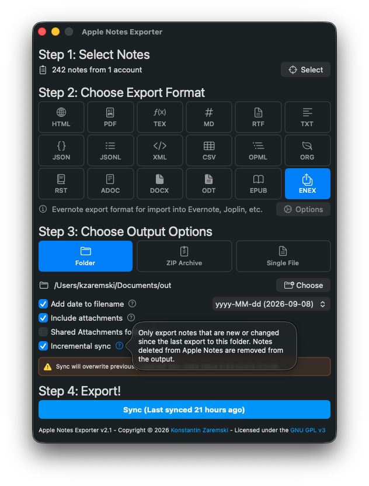
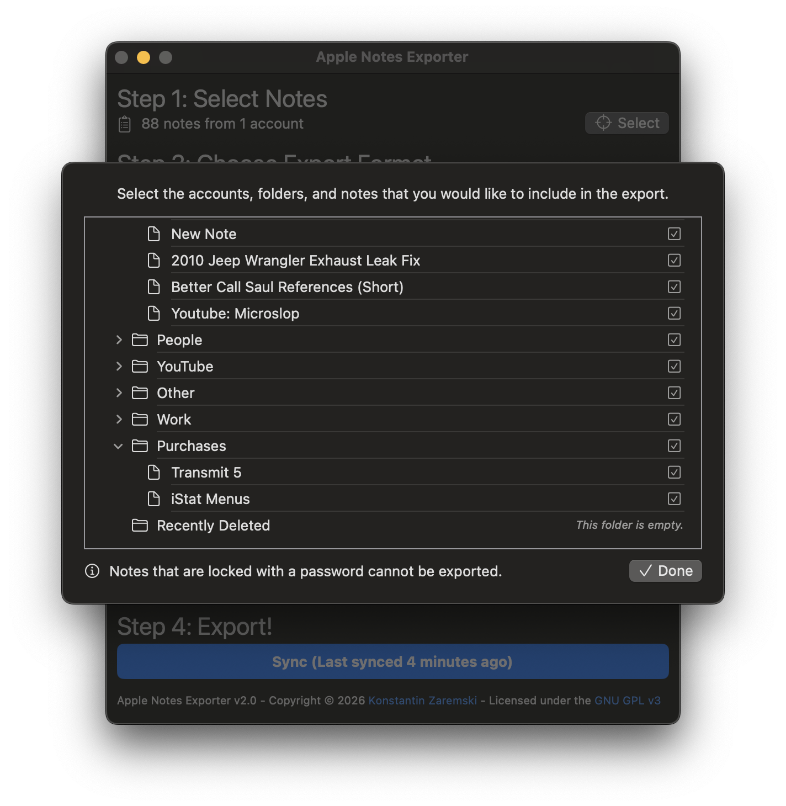
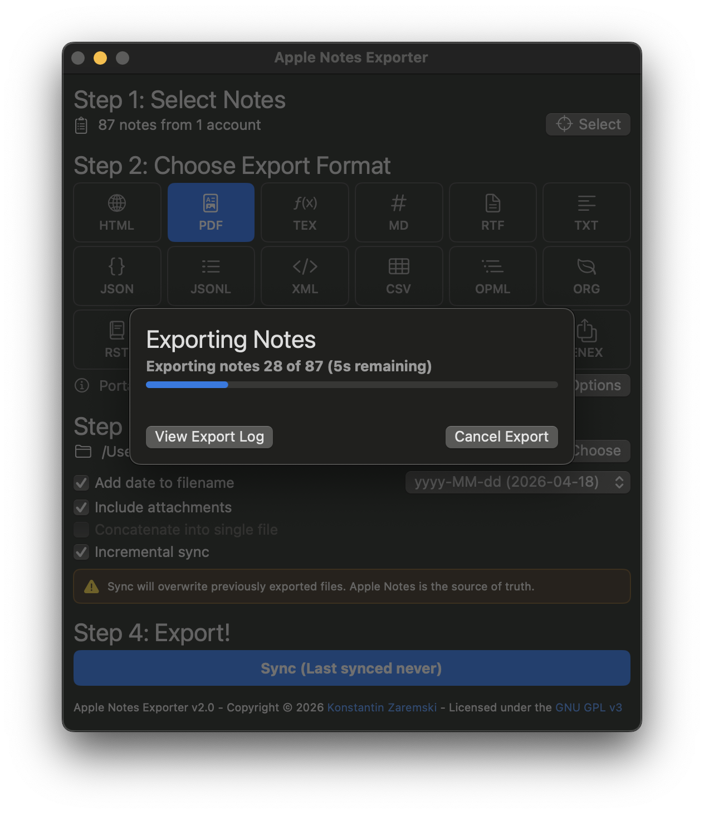
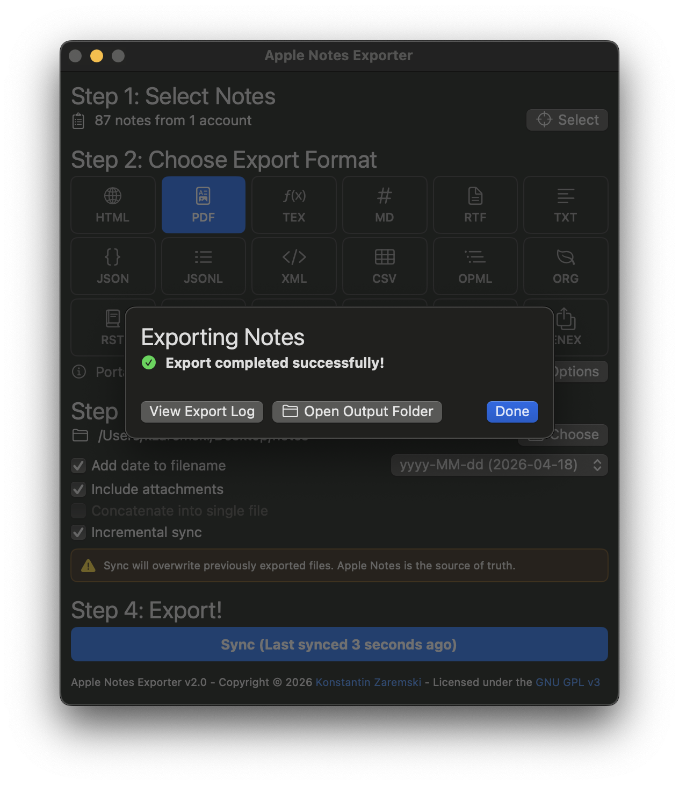
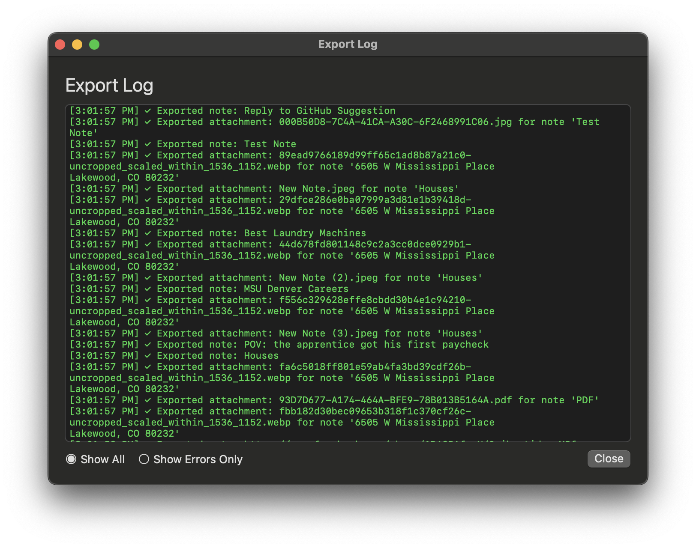
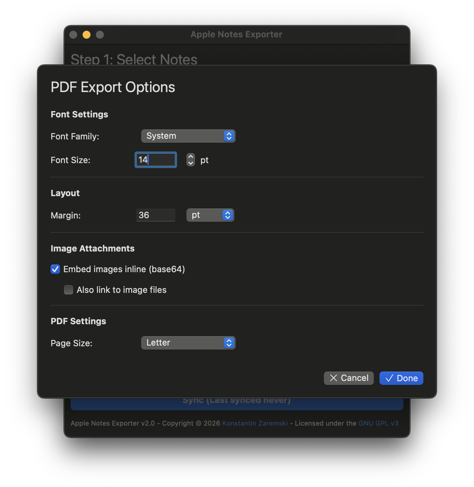
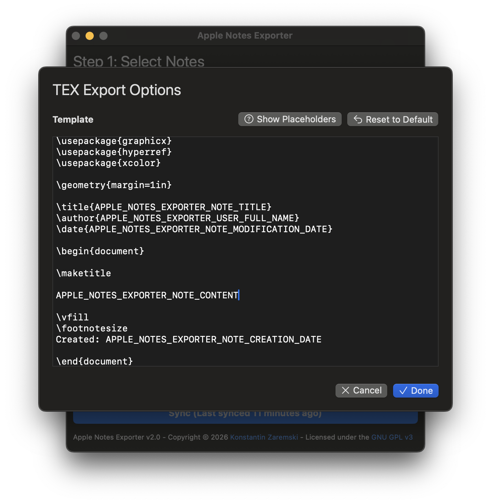

# Apple Notes Exporter (apple-notes-exporter)

[](https://www.gnu.org/licenses/gpl-3.0)
[](https://www.apple.com/macos/)
[](https://github.com/kzaremski/apple-notes-exporter/releases/latest)
[](https://github.com/kzaremski/apple-notes-exporter/releases)
[](https://github.com/kzaremski/apple-notes-exporter/stargazers)
[](https://github.com/kzaremski/apple-notes-exporter/issues)
[](https://github.com/kzaremski/apple-notes-exporter/commits/main)
[](https://swift.org/)

MacOS app written in Swift that bulk exports Apple Notes (including iCloud Notes) to a multitude of formats preserving note folder structure.

Built by [Konstantin Zaremski](https://konstantin.zarem.ski)



## Purpose & Rationale

Many choose to do all of their note taking and planning through Apple Notes because of the simplicity and convenience that it offers. Unfortunately, there is no good workflow or mechanism built into Apple Notes that allows you to export all your notes or a group of your notes at once.  This app provides a fast, efficient way to export your entire notes library while maintaining the folder hierarchy and preserving formatting.

## What's New in v2.1

* **Folder selection in the CLI.** `--folder` now takes an exact name **or** a folder id, can be repeated or comma-separated, and includes subfolders by default. `--folder-contains` restores the old substring behaviour and `--no-subfolders` limits a selection to direct children.
* **Recently Deleted export** via `--include-deleted`, or `--folder "Recently Deleted"`.
* **Sync history.** Each incremental run appends a file-level diff (added, updated, deleted) to the manifest, and `notes-export sync-status` prints the recent history.
* **Deleted notes are pruned** from the output directory on incremental runs instead of being left behind.
* **Shared attachment dumps** with `--shared-attachments`, writing every file under `Attachments/` instead of a folder beside each note.
* **Optional HTML folder indexes** (`--html-indexes`) so an HTML export is browsable in a web browser.
* **Internal note links resolve.** `applenotes:note/UUID` links were looked up by the wrong key and never rewrote in HTML or Markdown exports.
* **Unfiled notes** land in the account's default folder instead of a synthetic "Unknown Folder", and the folder is matched by Apple's own marker so localized libraries work.
* **Full Disk Access** registration uses an absolute path, and the app now explains how to add itself to the list if it does not appear.
* **Database access is serialized**, fixing intermittent "no accounts found" failures in the GUI.
* **EPUBs open in Apple Books** (correct EPUB 3 OCF layout), plus DOCX/ODT fixes.
* **ZIP or Single File output.** Step 3 now picks how the export is delivered: a folder tree, one `.zip`, or a single joined file. ZIP and Single File let you name the file, and the CLI takes `--zip` and `--concatenate` with an `--output` that may name the archive or file directly. File dates are preserved inside archives.
* **Single File works for 14 formats, not 2.** The GUI previously offered it for Markdown and plain text only, though it could always produce the rest. It is now available for every format except the packaged ones (PDF, DOCX, ODT, EPUB), and the CLI refuses those instead of writing a DOCX into a text file.
* **ENEX imports into Evernote.** Images were left inline as base64, putting one note's content 22x over Evernote's 5 MB limit. They are now `<resource>` elements referenced by `<en-media>`, and the output validates against Evernote's own `enml2.dtd` and `evernote-export3.dtd`. Notes that still exceed the per-note size limit are called out in the export log.
* **Shortcuts exposes the whole exporter.** The Export action carried its own cut-down copy of the export logic and offered 7 parameters; it now runs the same engine as the CLI with 29, plus new **List Notes** and **Sync Status** actions.
* **MCP setup in the app.** Help > Connect to an AI Assistant shows the server path and a copyable Claude Desktop config. The server gains `get_note` for reading one note's real content in any text format, and `export_notes` now matches the CLI option for option.
* **A working Help menu.** It previously raised "Help isn't available for Apple Notes Exporter"; it now links to the documentation, Full Disk Access setup, and the issue tracker.
* **Mistyped folder filters fail loudly.** `--folder` with a name that matches nothing used to fall through to "no filter" and export the entire library; it now errors and lists the folders that do exist.
* **Incremental sync no longer deletes filtered-out notes.** Pruning is judged against the whole library rather than the current run's selection, so exporting one folder into an existing sync directory does not remove the others.

## What's New in v2.0

* **Command-line interface** (`notes-export`) with subcommands for listing accounts, folders, and notes, plus full export support. JSON output for scripting.
* **Model Context Protocol server** (`notes-export-mcp`) exposes the exporter as MCP tools for AI assistants like Claude Desktop.
* **Apple Shortcuts support** via App Intents: Export Notes, List Accounts, and List Folders actions.
* **12 new export formats** in addition to the original 6 (18 total).
* **New app icon** designed by [Sascha Schneppmüller](https://github.com/Schneppi).
* **Gallery attachment fixes** for On My Mac notes, handwritten note title resolution on macOS 15+, and correct file extensions for attachments without a database filename.

## Export Formats

### Rich / document formats
* **HTML** - Native format returned by the Apple Notes database. Images included inline via base64 embed syntax. Optional `index.html` in each folder (off by default) so the tree is browsable in a web browser. **Configurable:** font family, font size, margins, folder indexes.
* **PDF** - Generated from HTML, preserves all formatting and images. **Configurable:** font family, font size, margins, page size (Letter, A4, A5, Legal, Tabloid).
* **TEX** - LaTeX format for typesetting. Notes can be compiled individually or combined. **Configurable:** custom template with placeholders for title, dates, author, and content.
* **MD** - Markdown format. Useful for moving to other Markdown-based apps like Obsidian. Images included inline via base64 embed syntax.
* **RTF** - Rich text format. Opens in WordPad (Windows) or TextEdit (macOS). **Configurable:** font family and font size.
* **TXT** - Plain text, no formatting or images.
* **DOCX** - Microsoft Word format for Office and Google Docs.
* **ODT** - OpenDocument text for LibreOffice and other open-source editors.
* **EPUB** - E-book format for Kindle, Apple Books, and other e-readers. Archives follow the EPUB 3 OCF layout (uncompressed `mimetype` first) so Apple Books can open them.

### Structured / data formats
* **JSON** - Structured note data for APIs and data processing.
* **JSONL** - One JSON object per line; ideal for LLM and RAG pipelines.
* **XML** - Structured note data in XML for interoperability.
* **CSV** - Flat table format for spreadsheets and databases.

### Outline / documentation formats
* **OPML** - Outline format for RSS readers and outliners.
* **ORG** - Emacs Org-mode format for notes and task management.
* **RST** - reStructuredText for Sphinx and Python documentation.
* **ADOC** - AsciiDoc format for technical documentation.

### Interchange formats
* **ENEX** - Evernote export format for import into Evernote, Joplin, and similar apps. Images are written as `<resource>` elements referenced by `<en-media>`, so note content stays within Evernote's 5 MB `EDAM_NOTE_CONTENT_LEN_MAX`; output validates against `enml2.dtd` and `evernote-export3.dtd`.

Attachments are always saved in a folder corresponding to the name/title of the note that they are associated with.

## Scripting & Automation

In addition to the GUI app, Apple Notes Exporter ships three ways to drive the exporter from other tools:

### Command-line interface (`notes-export`)

```sh
notes-export list-accounts
notes-export list-folders --account iCloud
notes-export list-notes --folder Work
notes-export export --output ~/Desktop/notes --format markdown --account iCloud
```

Built with Swift ArgumentParser. JSON output on stdout for piping into other tools, progress and errors on stderr. `--zip` delivers the export as one archive and `--concatenate` as one file; in both cases `--output` may name the file itself or a directory to receive the default name. `--folder` takes an exact name or id (repeat or comma-separate for several) and includes subfolders; `--folder-contains` restores substring match; `--no-subfolders` turns descendants off. Combine `--folder` and `--notes` as a union. `--include-deleted` (or `--folder "Recently Deleted"`) exports trash. `--shared-attachments` dumps every file under `Attachments/` instead of a folder beside each note.

### Apple Shortcuts (App Intents)

Five actions are available in the Shortcuts app under "Apple Notes Exporter":

* **Export Notes** - Every option the CLI has: format, folder and account filters, title and date filters, ZIP or single-file output, incremental sync, attachments and HTML indexes.
* **List Notes** - Notes matching the same filters, for feeding into the rest of a shortcut.
* **List Accounts** - Returns a list of available note accounts.
* **List Folders** - Returns a list of folders, optionally filtered by account.
* **Sync Status** - Reports the incremental sync state of a folder without opening the Notes database.

Run them from Siri, automations, or any Shortcuts flow.

Unsigned Debug builds (Xcode Run) often fail to register with Shortcuts (`linkd` error 4097). Use a signed build, typically the copy in `/Applications`, and grant Full Disk Access to that same binary.

To run `notes-export` from a Shortcuts **Run Shell Script** action without opening Terminal, grant Full Disk Access to **Shortcuts.app** as well. The CLI lives at `Apple Notes Exporter.app/Contents/SharedSupport/notes-export`.

### Model Context Protocol server (`notes-export-mcp`)

An MCP server so AI assistants like Claude Desktop can read and export your notes directly. Six tools:

| Tool | Purpose |
|------|---------|
| `list_accounts` | Available note accounts. |
| `list_folders` | Folders, optionally filtered by account. |
| `list_notes` | Notes with folder, account, title and date filtering. `include_content` embeds plaintext. |
| `get_note` | One note's full content by id, rendered as Markdown, HTML, or any other text format, plus its attachment list. |
| `export_notes` | Run a partial or full export with every option the CLI supports, including `zip`, `concatenate` and `incremental`. |
| `sync_status` | Incremental sync state of an output directory, without opening the Notes database. |

`export_notes` only writes under `$HOME` or `/tmp`, so adversarial note content cannot steer an assistant into writing to sensitive locations.

The app can set this up for you: **Help > Connect to an AI Assistant...** shows the server path and a Claude Desktop config block to copy. Note content is user-authored and should be treated as untrusted input.

All three require Full Disk Access (same as the GUI app) to read the local Notes database.

## Incremental Sync

Re-exporting an entire Notes library on every backup is wasteful when only a handful of notes have changed. Incremental sync tracks which notes have already been exported and, on subsequent runs, writes only notes that are new or have been modified since the last export.

On first run with `--incremental`, the CLI writes a `AppleNotesExportSyncWatermark.json` manifest to the output directory recording each note's ID, modification date, and exported path. On subsequent runs against the same directory, notes whose modification date has not changed are skipped, and existing files are left in place. Notes that have disappeared from Apple Notes are pruned from disk. Each run appends a file/folder-level diff (added, updated, deleted paths and a timestamp) to the manifest; `notes-export sync-status` prints the recent history.

```sh
# First run: full export
notes-export export --output ~/backups/notes --format markdown --incremental

# Second run: only new/changed notes get re-written
notes-export export --output ~/backups/notes --format markdown --incremental

# Force a full re-export, wiping the manifest
notes-export export --output ~/backups/notes --format markdown --incremental --reset-sync

# Inspect manifest state without touching the database
notes-export sync-status --output ~/backups/notes
```

The GUI also exposes incremental sync as a toggle in the export options. Incremental sync and concatenation are mutually exclusive (see below); incremental requires per-note files.

## Concatenation

For quick dumps of many notes into one file, the `--concatenate` flag joins every exported note into a single `Exported Notes.<ext>` in the output directory, with format-appropriate separators between notes (page breaks in HTML/TEX, `---` rules in Markdown, row of equals signs in TXT).

```sh
notes-export export --output ~/Desktop --format markdown --concatenate
# Produces: ~/Desktop/Exported Notes.md

notes-export export --output ~/Desktop/My\ Notes.md --format markdown --concatenate
# Or name the file yourself
```

Concatenation is only supported for Markdown and plain text in the GUI; the CLI additionally supports HTML, RTF, and TeX. Concatenation is not compatible with `--incremental` (it would rewrite the whole concatenated file every time regardless) and is not available for the packaged binary formats (DOCX, ODT, EPUB, PDF).

## Compatibility & System Requirements
* MacOS Big Sur 11.0 or higher
    * Some of the features used are not available in earlier MacOS versions.
    * Backported from Ventura to Big Sur; earlier versions would require UI rewrites.
* Intel or Apple Silicon Mac
* 4GB RAM minimum
    * Optimized database-driven approach uses approximately 200MB of RAM regardless of Notes library size
    * Concurrent export processing for maximum performance
* Disk Space
    * 20MB to accommodate the app itself
    * Additional space for your exported notes and their attachments

## Limitations
As of version 1.0, Apple Notes Exporter no longer supports exporting from accounts other than iCloud accounts and the On My Mac account. This includes notes stored in Gmail, Yahoo, Outlook, and other email-based accounts.

### Workaround for Email Account Notes
If you have notes in Gmail, Yahoo, Outlook, or other email accounts that you want to export:

1. Open the Apple Notes app
2. Select the notes you want to export from your email account
3. Drag and drop them into a folder under "On My Mac" or one of your iCloud accounts
4. Once moved, these notes will be accessible to Apple Notes Exporter and can be included in your export

This limitation is due to the database-driven approach used in version 1.0, which queries the local Notes database directly. Email-based note accounts store their data differently and are not included in the same database structure that iCloud and On My Mac accounts use.

## Additional Screenshots

The screenshots below are from v2.0; Step 3 gained the Folder / ZIP Archive / Single File selector in v2.1.

**Note Selection**


**Export Progress**


**Export Complete**


**Detailed Export Log**


**PDF Export Options**


**LaTeX Template Editor**


## Installation
The latest download is available from the Github "Releases" tab.

Make sure that you have "App Store and Identified Developers" set as your app install sources in the "Privacy & Security" section of System Settings in MacOS.

**Full Disk Access:** the app tries to register itself by reading the Notes database at an absolute path, then opens System Settings. macOS still requires you to enable the checkbox; there is no API that grants Full Disk Access. If the app does not appear in the list, click +, or drag Apple Notes Exporter.app from Finder / Applications into Full Disk Access. Use a **signed** copy (Developer ID for release, or a Development-signed Debug build). Unsigned binaries often never appear, and the Debug build from Xcode is a different binary than the one in /Applications.

**As of Version 0.4 Build 5, we are distributing a notarized executable.** *For older versions, go to the "Privacy & Security" pane of System Settings and click "Open Anyway" under the "Security" section towards the bottom of the pane. See Apple's article https://support.apple.com/en-us/HT202491 if you need more help or a better explanation on how to make an exception for the app to run.*

## Acknowledgements

This project benefited from the groundwork and research done by [threeplanetssoftware](https://github.com/threeplanetssoftware) on Apple Notes protobuf formats and database parsing in their [apple_cloud_notes_parser](https://github.com/threeplanetssoftware/apple_cloud_notes_parser) project. Their work was instrumental in understanding the Apple Notes database structure, enabling the transition from AppleScript-based export to the more efficient database-driven approach used in version 1.0.

Thanks to everyone who has contributed to this project:

* [Christian Hovenbitzer (@AnotherCoolDude)](https://github.com/AnotherCoolDude) - CLI and MCP server targets for v2.0
* [Sascha Schneppmüller (@Schneppi)](https://github.com/Schneppi) - Redesigned app icon for v2.0
* [Sergey Nikolsky (@nikolsky2)](https://github.com/nikolsky2) - Fixed a crash when AppleScript returned empty notes
* [David Ginsburg (@davideg)](https://github.com/davideg) - Fixed Markdown export to decode HTML entities
* [Vaughan Risher (@vrisher)](https://github.com/vrisher) - Preserved image attachments in Markdown exports

See [CONTRIBUTORS.txt](CONTRIBUTORS.txt) for the full list.

<table>
  <tr>
    <td align="center">
      <a href="https://github.com/kzaremski">
        <br />
        <sub><b>@kzaremski</b></sub>
      </a>
    </td>
    <td align="center">
      <a href="https://github.com/AnotherCoolDude">
        <br />
        <sub><b>@AnotherCoolDude</b></sub>
      </a>
    </td>
    <td align="center">
      <a href="https://github.com/Schneppi">
        <br />
        <sub><b>@Schneppi</b></sub>
      </a>
    </td>
    <td align="center">
      <a href="https://github.com/nikolsky2">
        <br />
        <sub><b>@nikolsky2</b></sub>
      </a>
    </td>
    <td align="center">
      <a href="https://github.com/davideg">
        <br />
        <sub><b>@davideg</b></sub>
      </a>
    </td>
    <td align="center">
      <a href="https://github.com/vrisher">
        <br />
        <sub><b>@vrisher</b></sub>
      </a>
    </td>
  </tr>
</table>

## License

This program is free software: you can redistribute it and/or modify it under the terms of the GNU General Public License as published by the Free Software Foundation, either version 3 of the License, or (at your option) any later version.

This program is distributed in the hope that it will be useful, but WITHOUT ANY WARRANTY; without even the implied warranty of MERCHANTABILITY or FITNESS FOR A PARTICULAR PURPOSE. See the GNU General Public License for more details.

You should have received a copy of the GNU General Public License along with this program. If not, see <https://www.gnu.org/licenses/>.

```
Apple Notes Exporter
Copyright (C) 2026 Konstantin Zaremski
Licensed under the GNU General Public License v3.0
```

## Star History

[](https://www.star-history.com/#kzaremski/apple-notes-exporter&type=date&legend=top-left)
